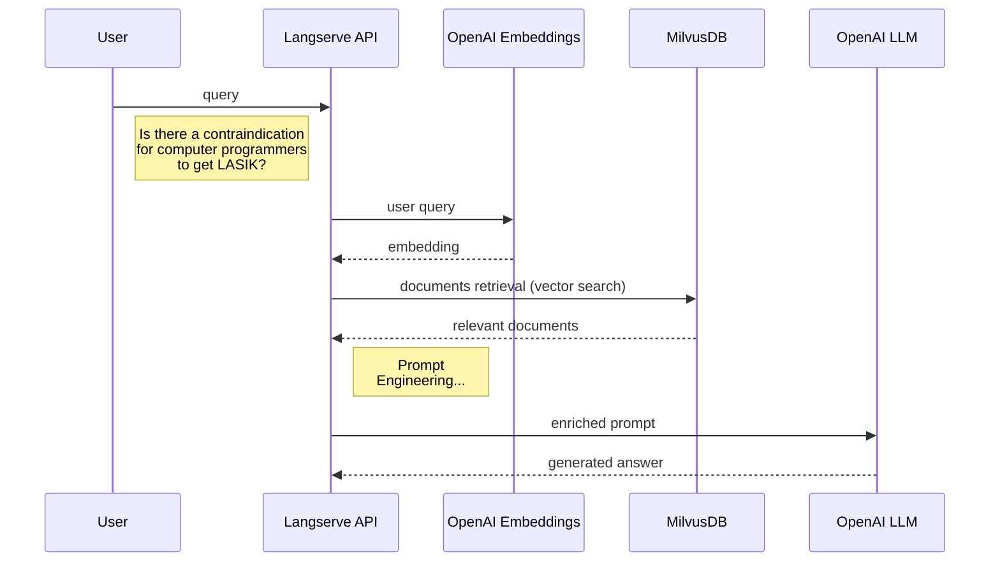

# lasik-openai-rag

Demo LLM (RAG pipeline) web app running locally using docker-compose. LLM and embedding models are consumed from OpenAI.

## 1 - Target setup

A Retrieval Augmented Generation (RAG) pipeline is a NLP framework that combines information retrieval with text generation to produce responses or generate text. It uses a retriever to find relevant information and a generator to create responses based on that information.

The app architecture is presented below:

<insert diagram>




## 2 - Prerequisites

- [Docker](https://docs.docker.com/get-docker/)
- An [OpenAI key](https://openai.com/)(account should be provisioned with $5, which is the minimum amount allowed)

## 3 - Quickstart

Spin up Milvus DB:

```bash
make db-up
```

Build app Docker image:

```bash
make app-build
```

Set your OpenAI API key as environment variable

```bash
export OPENAI_API_KEY=<your-api-key>
```

Populate DB with the LASIK eye surgery complications dataset:

```bash
make db-populate
```

Spin-up API:

```bash
make app-run
```

The chatbot is now available at [http://localhost:8000/lasik_complications/playground/](http://localhost:8000/lasik_complications/playground/)

<insert image>


Display all available commands with:

```bash
make help
```

<insert screenshot>

Clean up

```bash
make clean
```

## 4 - Project file structure

## Milvus

[Milvus] is an open-source vector database engine developed by Zilliz, designed to store and manage large-scale vector data, such as embeddings, features, and high-dimensional data. It provides efficient storage, indexing, and retrieval capabilities for **vector similarity search tasks**.

## LLMOps

## 5 - Langchain

## 6 - Prompt Engineering

## 7 - Langserve

