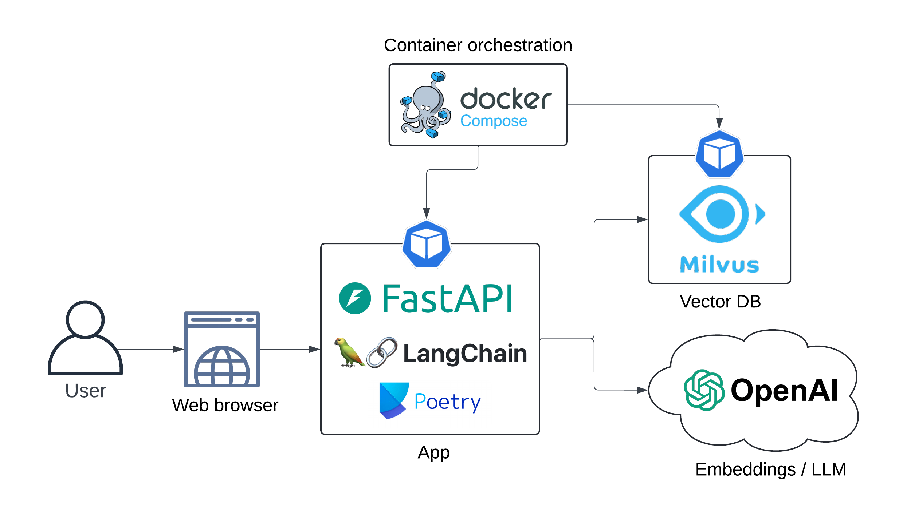
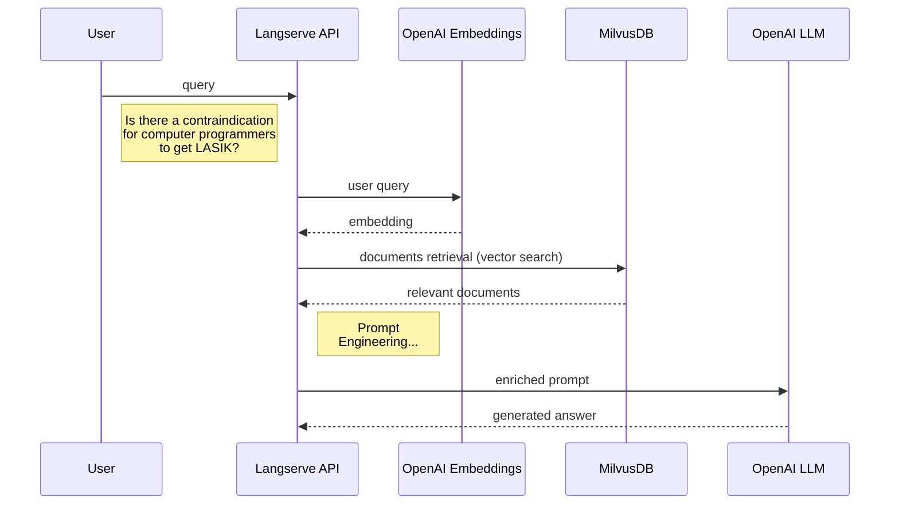
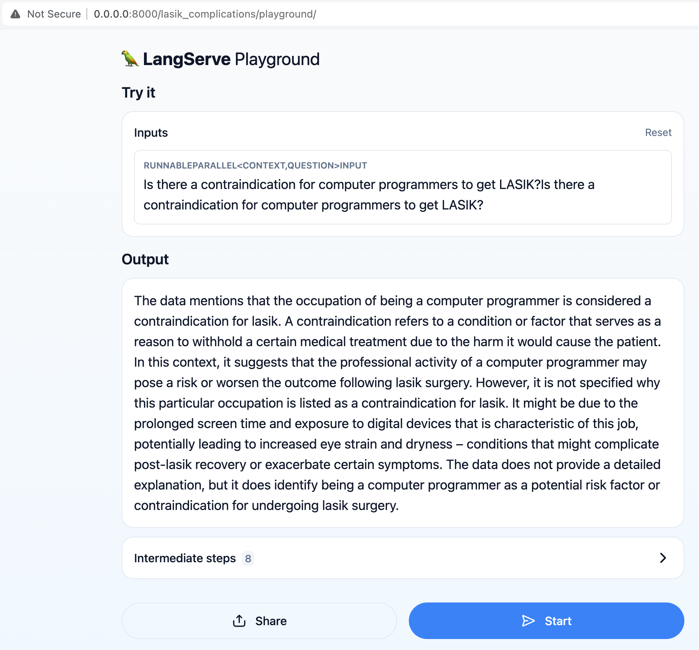
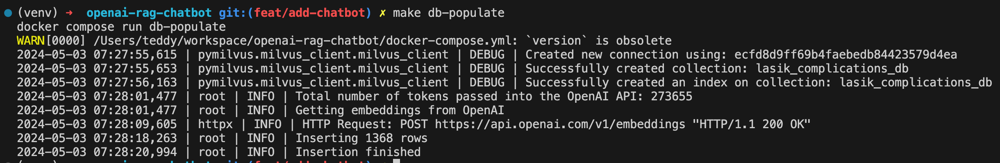
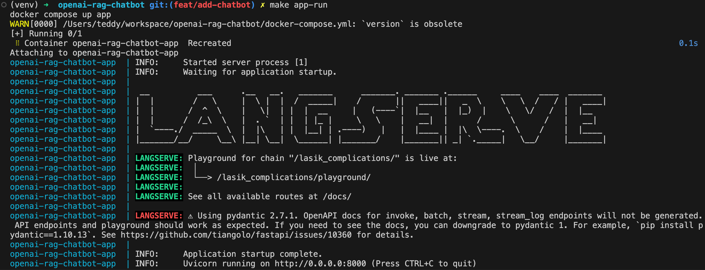
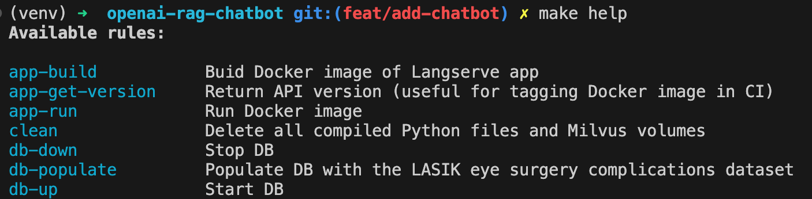
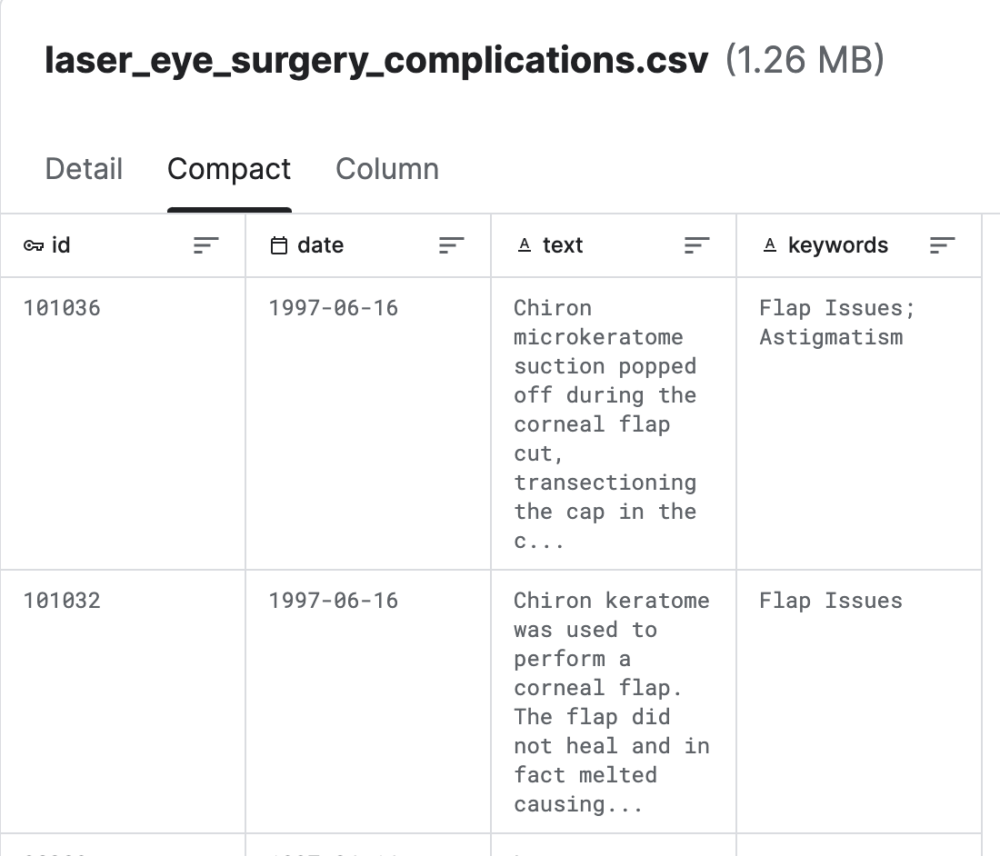
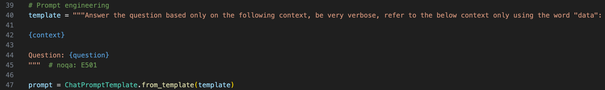
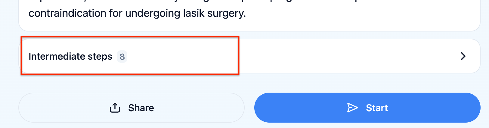

# lasik-openai-rag &middot; 


Demo LLM (RAG pipeline) web app running locally using docker-compose. LLM and embedding models are consumed as services from OpenAI.

The primary objective is to enable users to ask questions related to LASIK surgery, such as *"Is there a contraindication for computer programmers to get LASIK?"*

The Retrieval Augmented Generation (RAG) pipeline retrieves the most up-to-date information from the dataset to provide accurate and relevant responses to user queries.

## Target setup

The app architecture is presented below:



Sequence diagram:



UX:




## Prerequisites

- [Docker](https://docs.docker.com/get-docker/)
- An [OpenAI key](https://openai.com/)(account should be provisioned with $5, which is the minimum amount allowed)

## Quickstart

Build app Docker image:

```bash
make app-build
```

Set your OpenAI API key as environment variable

```bash
export OPENAI_API_KEY=<your-api-key>
```

Spin up Milvus DB:

```bash
make db-up
```

Populate DB with the LASIK eye surgery complications dataset:

```bash
make db-populate
```



Spin-up API:

```bash
make app-run
```



The chatbot is now available at [http://localhost:8000/lasik_complications/playground/](http://localhost:8000/lasik_complications/playground/)

Display all available commands with:

```bash
make help
```



Clean up

```bash
make clean
```

## Project file structure

```text
├── .github
│   ├── workflow
│   │   └── cicd.yml       <- CI pipeline definition
├── data
│   └── laser_eye_surgery_complications.csv       <- Kaggle dataset
|
├── docs
│   ├── diagrams      <- Folder containing diagram definitions
│   └── img           <-  Folder containing screenshots
│
├── src
│   ├── config.py                  <- Config file with service host/ports or models to be used
│   ├── populate_vector_db.py      <- Scripts that converts texts to embeddings and populates Milvus DB
│   └── server.py                  <- FastAPI/Langserve/Langchain
│
├── .gitignore
├── .pre-commit-config.yaml        <- ruff linter pre-commit hook
├── docker-compose.yml             <- container orchestration
├── Dockerfile                     <- App image definition
├── Makefile                       <- Makefile with commands like `make app-build`
├── poetry.lock                    <- Pinned dependencies
├── pyproject.toml                 <- Dependencies requirements
├── README.md                      <- The top-level README for developers using this project.
└── ruff.toml                      <- Linter config
```

## The dataset

Sourced from [Lasik (Laser Eye Surgery) Complications](https://www.kaggle.com/datasets/shivamb/lasik-complications-dataset/data)(Kaggle)



## Milvus

[Milvus](https://github.com/milvus-io/milvus) is an open-source vector database engine developed by Zilliz, designed to store and manage large-scale vector data, such as embeddings, features, and high-dimensional data. It provides efficient storage, indexing, and retrieval capabilities for **vector similarity search tasks**.

## CICD


## Langchain

Langchain is a LLM orchestration tool, it is very useful when you need to build context-aware LLM apps.

## Prompt Engineering

In order to provide the context to the LLM, we have to wrap the original question in a [prompt template](./src/server.py#L39)



You can check what prompt the LLM actually received by clicking on "intermediate steps" in the UX



## Langserve

LangServe helps developers deploy LangChain runnables and chains as a REST API. This library is integrated with FastAPI.

## To do

- The chatbot cannot answer questions related to stats, for example *"Are there any recent trends in LASIK surgery complications?"*, there should be another model that infers the relevant time-window to consider for retrieving the documents and then enrich the final prompt with this time-window.

- [Algorithmic feedback with Langsmith](https://github.com/langchain-ai/langsmith-cookbook/blob/main/feedback-examples/algorithmic-feedback/algorithmic_feedback.ipynb). This would allow to test the robustness of the LLM chain in an automated way.

## Useful resources

- [OpenAI Prompt engineering](https://platform.openai.com/docs/guides/prompt-engineering)
